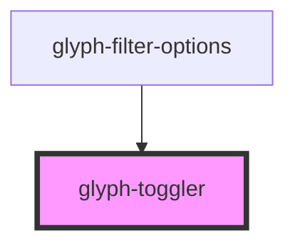

# glyph-toggler

<!-- Auto Generated Below -->

## Properties

| Property    | Attribute   | Description                          | Type                                        | Default               |
| ----------- | ----------- | ------------------------------------ | ------------------------------------------- | --------------------- |
| `active`    | `active`    | Toggler state                        | `boolean`                                   | `false`               |
| `interface` | `interface` | Interface type ['MODERN', 'CLASSIC'] | `UIInterface.classic \| UIInterface.modern` | `UIInterface.classic` |

## Dependencies

### Used by

 - [glyph-filter-options](../filter/components/options)

### Graph

----------------------------------------------

