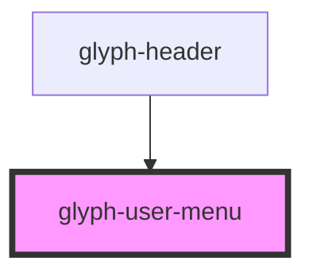

# glyph-user-menu

<!-- Auto Generated Below -->

## Properties

| Property          | Attribute | Description                                                  | Type                         | Default     |
| ----------------- | --------- | ------------------------------------------------------------ | ---------------------------- | ----------- |
| `i18n`            | --        | Extra i18n translation object                                | `{ [key: string]: string; }` | `{}`        |
| `name`            | `name`    | User name                                                    | `string`                     | `undefined` |
| `outsideCallback` | --        | Event triggered when user clicks outside component container | `() => void`                 | `undefined` |

## Events

| Event    | Description                                                   | Type               |
| -------- | ------------------------------------------------------------- | ------------------ |
| `logout` | Logout event, trigger an event identified with **logout** key | `CustomEvent<any>` |

## Dependencies

### Used by

 - [glyph-header](../header)

### Graph

----------------------------------------------

