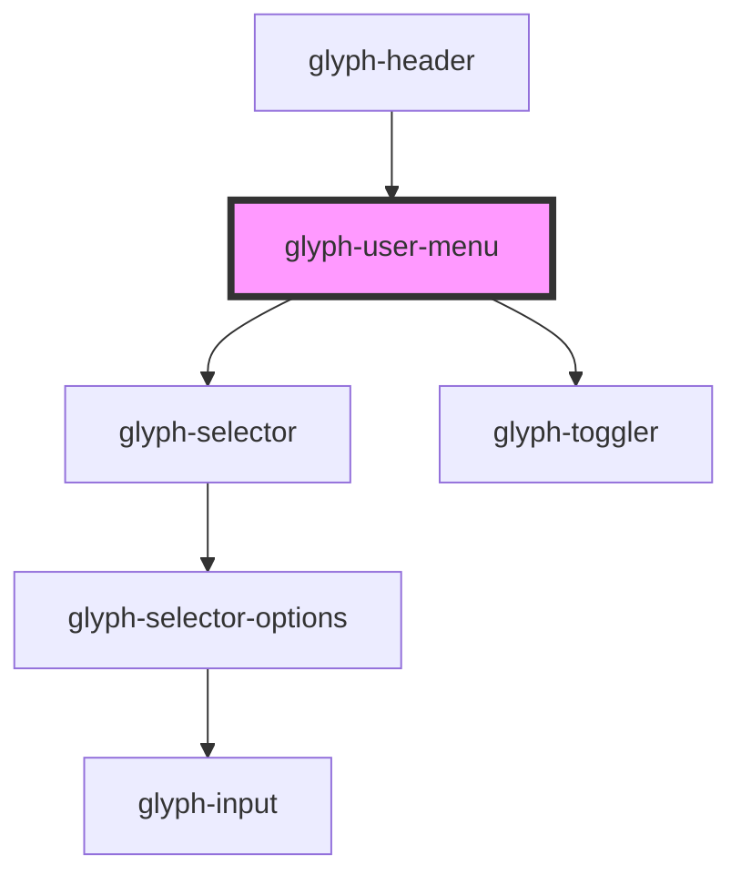

# glyph-user-menu

<!-- Auto Generated Below -->

## Properties

| Property          | Attribute       | Description                                                      | Type                                        | Default               |
| ----------------- | --------------- | ---------------------------------------------------------------- | ------------------------------------------- | --------------------- |
| `basePath`        | `base-path`     | Base path to get assets                                          | `string`                                    | `''`                  |
| `customConfig`    | `custom-config` | Show custom config button                                        | `boolean`                                   | `undefined`           |
| `decimals`        | `decimals`      | Show decimal config flag                                         | `boolean`                                   | `undefined`           |
| `i18n`            | --              | Extra i18n translation object                                    | `{ [key: string]: string; }`                | `{}`                  |
| `interface`       | `interface`     | Interface type ['MODERN', 'CLASSIC']                             | `UIInterface.classic \| UIInterface.modern` | `UIInterface.classic` |
| `languages`       | --              | Application languages                                            | `SelectorOption[]`                          | `undefined`           |
| `locale`          | `locale`        | **optional** force locale change if html lang is not interpreted | `string`                                    | `undefined`           |
| `name`            | `name`          | User name                                                        | `string`                                    | `undefined`           |
| `outsideCallback` | --              | Event triggered when user clicks outside component container     | `() => void`                                | `undefined`           |
| `themes`          | --              | Application themes                                               | `SelectorOption[]`                          | `undefined`           |

## Events

| Event            | Description                                                   | Type                          |
| ---------------- | ------------------------------------------------------------- | ----------------------------- |
| `decimalsChange` | Decimals change event                                         | `CustomEvent<boolean>`        |
| `langChange`     | Language change event                                         | `CustomEvent<SelectorOption>` |
| `logout`         | Logout event, trigger an event identified with **logout** key | `CustomEvent<any>`            |
| `themeChange`    | Theme change event                                            | `CustomEvent<SelectorOption>` |

## Dependencies

### Used by

 - [glyph-header](../layouts/header)

### Depends on

- [glyph-selector](../selector)
- [glyph-toggler](../toggler)

### Graph

----------------------------------------------

