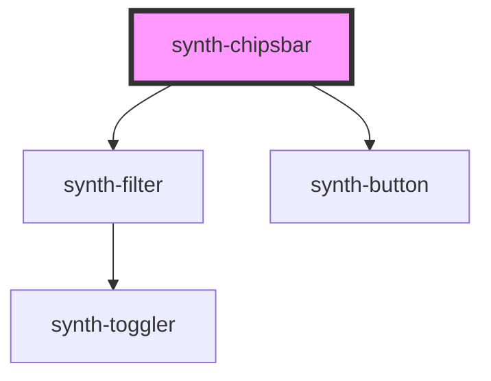

# synth-chipsbar

<!-- Auto Generated Below -->

## Properties

| Property        | Attribute | Description                   | Type                         | Default     |
| --------------- | --------- | ----------------------------- | ---------------------------- | ----------- |
| `filtersConfig` | --        | Filters configuration object  | `FiltersConfig`              | `undefined` |
| `i18n`          | --        | Extra i18n translation object | `{ [key: string]: string; }` | `{}`        |

## Events

| Event               | Description              | Type               |
| ------------------- | ------------------------ | ------------------ |
| `clearAll`          | Clear all filters event  | `CustomEvent<any>` |
| `filterClear`       | Filter clear event       | `CustomEvent<any>` |
| `filterMultiSelect` | Filter multiselect event | `CustomEvent<any>` |
| `filterSelect`      | Filter select event      | `CustomEvent<any>` |

## Dependencies

### Depends on

- [synth-filter](../filter)
- [synth-button](../button)

### Graph

----------------------------------------------

