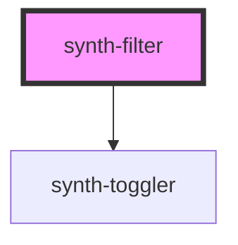

# synth-filter

<!-- Auto Generated Below -->

## Properties

| Property            | Attribute            | Description                                                 | Type                         | Default     |
| ------------------- | -------------------- | ----------------------------------------------------------- | ---------------------------- | ----------- |
| `description`       | `description`        | Filter description                                          | `string`                     | `undefined` |
| `haveMultiSelect`   | `have-multi-select`  | Multiselect flag. True if filter allows multiselect toggler | `boolean`                    | `true`      |
| `i18n`              | --                   | Extra i18n translation object                               | `{ [key: string]: string; }` | `{}`        |
| `multiSelect`       | `multi-select`       | This flag is true if multiselect is active                  | `boolean`                    | `false`     |
| `options`           | --                   | Filter options                                              | `FilterOptionHeader[]`       | `undefined` |
| `plural`            | `plural`             | Filter plural                                               | `string`                     | `undefined` |
| `searchPlaceholder` | `search-placeholder` | Search placeholder                                          | `string`                     | `undefined` |
| `selected`          | --                   | Filter selected                                             | `SelectedFilter[]`           | `undefined` |
| `update`            | `update`             | Force component update if flag is true                      | `boolean`                    | `false`     |

## Events

| Event              | Description                     | Type               |
| ------------------ | ------------------------------- | ------------------ |
| `clearEvent`       | Clear selected filters callback | `CustomEvent<any>` |
| `multiSelectEvent` | Multiselect toggler callback    | `CustomEvent<any>` |
| `optionClickEvent` | Option click event              | `CustomEvent<any>` |

## Dependencies

### Depends on

- [synth-toggler](../toggler)

### Graph

----------------------------------------------

