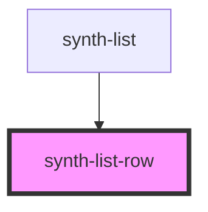

# fib-list-row

<!-- Auto Generated Below -->

## Properties

| Property     | Attribute    | Description | Type      | Default     |
| ------------ | ------------ | ----------- | --------- | ----------- |
| `expandable` | `expandable` |             | `boolean` | `undefined` |
| `i18n`       | `i-1-8n`     |             | `any`     | `{}`        |
| `isTotal`    | `is-total`   |             | `boolean` | `undefined` |
| `row`        | --           |             | `Row`     | `undefined` |

## Dependencies

### Used by

 - [synth-list](../..)

### Graph

----------------------------------------------

