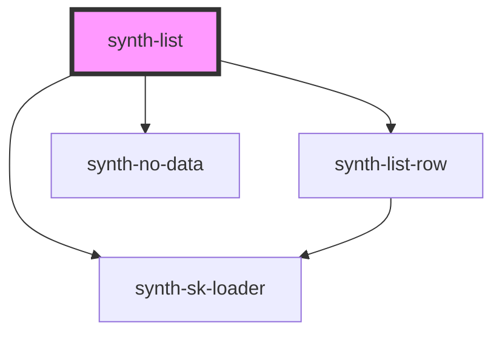

# synth-list

<!-- Auto Generated Below -->

## Properties

| Property           | Attribute            | Description                                                                     | Type                         | Default     |
| ------------------ | -------------------- | ------------------------------------------------------------------------------- | ---------------------------- | ----------- |
| `data`             | --                   | Component data. Fields preffixed with `_` will not render                       | `Row[]`                      | `undefined` |
| `decimals`         | `decimals`           | Show decimals flag                                                              | `boolean`                    | `undefined` |
| `defaultSortField` | `default-sort-field` | Default sorting field, it could be a private or public field                    | `string`                     | `undefined` |
| `enableDownload`   | `enable-download`    | Enable download xlsx file                                                       | `boolean`                    | `false`     |
| `expandable`       | `expandable`         | Expandable flag                                                                 | `boolean`                    | `false`     |
| `filterFields`     | --                   | Rows that has no data on these fields will not render                           | `string[]`                   | `undefined` |
| `i18n`             | --                   | Extra i18n translation object                                                   | `{ [key: string]: string; }` | `{}`        |
| `limit`            | `limit`              | Rows limit. If not set will take `16` as default value or `10` in small screens | `number`                     | `undefined` |
| `loading`          | `loading`            | Loading state. If true will render skeleton loader                              | `boolean`                    | `undefined` |
| `update`           | `update`             | Force component update if flag is true                                          | `boolean`                    | `false`     |

## Events

| Event       | Description      | Type                          |
| ----------- | ---------------- | ----------------------------- |
| `expandRow` | Expand row event | `CustomEvent<ExpandRowEvent>` |

## Dependencies

### Depends on

- [synth-list-row](./components/row)
- [synth-sk-loader](../skeleton-loader)
- [synth-no-data](../no-data)

### Graph

----------------------------------------------

