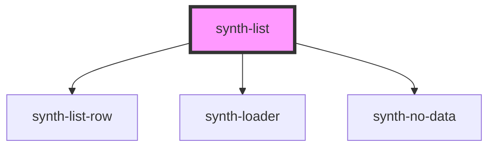

# fib-list

<!-- Auto Generated Below -->

## Properties

| Property           | Attribute            | Description | Type       | Default     |
| ------------------ | -------------------- | ----------- | ---------- | ----------- |
| `data`             | --                   |             | `Row[]`    | `undefined` |
| `decimals`         | `decimals`           |             | `boolean`  | `undefined` |
| `defaultSortField` | `default-sort-field` |             | `string`   | `undefined` |
| `enableDownload`   | `enable-download`    |             | `boolean`  | `false`     |
| `expandable`       | `expandable`         |             | `boolean`  | `undefined` |
| `filterFields`     | --                   |             | `string[]` | `undefined` |
| `limit`            | `limit`              |             | `number`   | `undefined` |
| `loading`          | `loading`            |             | `boolean`  | `undefined` |
| `update`           | `update`             |             | `boolean`  | `false`     |

## Dependencies

### Depends on

- [synth-list-row](./components/row)
- [synth-loader](../loader)
- [synth-no-data](../no-data)

### Graph

----------------------------------------------

*Built with [StencilJS](https://stenciljs.com/)*
