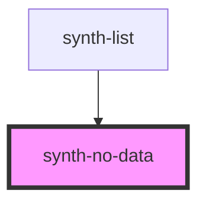

# synth-no-data

<!-- Auto Generated Below -->

## Properties

| Property     | Attribute     | Description                                          | Type                         | Default             |
| ------------ | ------------- | ---------------------------------------------------- | ---------------------------- | ------------------- |
| `bottomText` | `bottom-text` | Bottom text. only applies if render mode is advanced | `string`                     | `undefined`         |
| `i18n`       | --            | Extra i18n translation object                        | `{ [key: string]: string; }` | `{}`                |
| `mode`       | `mode`        | Render mode [ 'simple' \| 'complex' ]                | `string`                     | `NoDataType.Simple` |
| `text`       | `text`        | Top text only applies if render mode is advanced     | `string`                     | `undefined`         |

## Dependencies

### Used by

 - [synth-list](../list)

### Graph

----------------------------------------------

*Built with [StencilJS](https://stenciljs.com/)*
