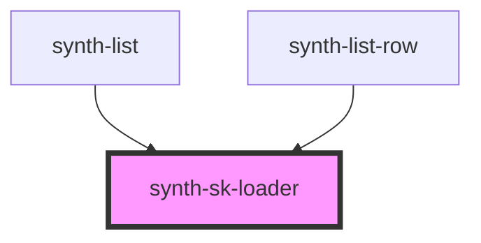

# synth-sk-loader

<!-- Auto Generated Below -->

## Properties

| Property      | Attribute     | Description                                  | Type     | Default |
| ------------- | ------------- | -------------------------------------------- | -------- | ------- |
| `height`      | `height`      | Height of loader line                        | `number` | `38`    |
| `repetitions` | `repetitions` | Number of loader lines that will be rendered | `number` | `1`     |

## Dependencies

### Used by

 - [synth-list](../list)
 - [synth-list-row](../list/components/row)

### Graph

----------------------------------------------

