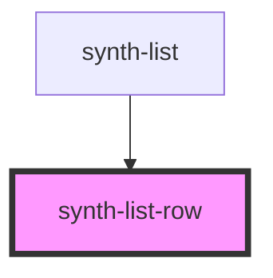

# fib-list-row

<!-- Auto Generated Below -->

## Properties

| Property         | Attribute         | Description | Type                                                                                                               | Default     |
| ---------------- | ----------------- | ----------- | ------------------------------------------------------------------------------------------------------------------ | ----------- |
| `decorationType` | `decoration-type` |             | `DecorationType.InvertedGreen \| DecorationType.InvertedRed \| DecorationType.OnlyGreen \| DecorationType.OnlyRed` | `undefined` |
| `expandable`     | `expandable`      |             | `boolean`                                                                                                          | `undefined` |
| `fieldsConfig`   | --                |             | `FieldsConfig[]`                                                                                                   | `undefined` |
| `i18n`           | `i-1-8n`          |             | `any`                                                                                                              | `undefined` |
| `isTotal`        | `is-total`        |             | `boolean`                                                                                                          | `undefined` |
| `row`            | --                |             | `Row`                                                                                                              | `undefined` |

## Dependencies

### Used by

 - [synth-list](../..)

### Graph

----------------------------------------------

*Built with [StencilJS](https://stenciljs.com/)*
