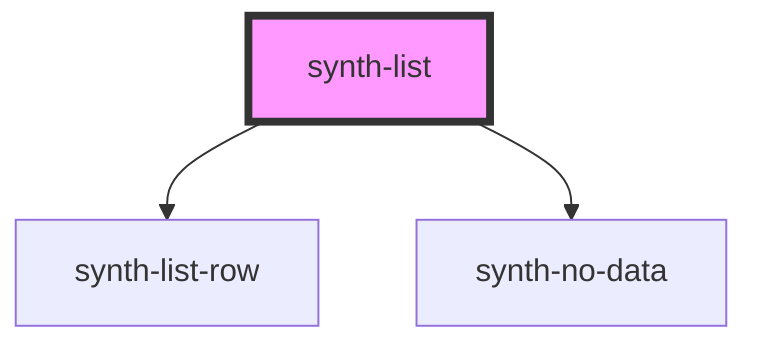

# fib-list

<!-- Auto Generated Below -->

## Properties

| Property         | Attribute         | Description | Type                                                                                                               | Default                    |
| ---------------- | ----------------- | ----------- | ------------------------------------------------------------------------------------------------------------------ | -------------------------- |
| `data`           | --                |             | `Row[]`                                                                                                            | `undefined`                |
| `decimals`       | `decimals`        |             | `boolean`                                                                                                          | `undefined`                |
| `decorationType` | `decoration-type` |             | `DecorationType.InvertedGreen \| DecorationType.InvertedRed \| DecorationType.OnlyGreen \| DecorationType.OnlyRed` | `DecorationType.OnlyGreen` |
| `enableDownload` | `enable-download` |             | `boolean`                                                                                                          | `false`                    |
| `expandable`     | `expandable`      |             | `boolean`                                                                                                          | `undefined`                |
| `fieldsConfig`   | --                |             | `FieldsConfig[]`                                                                                                   | `undefined`                |
| `filterFields`   | --                |             | `string[]`                                                                                                         | `undefined`                |
| `headerTitle`    | `header-title`    |             | `string`                                                                                                           | `undefined`                |
| `limit`          | `limit`           |             | `number`                                                                                                           | `LIMIT`                    |
| `loading`        | `loading`         |             | `boolean`                                                                                                          | `undefined`                |
| `update`         | `update`          |             | `boolean`                                                                                                          | `false`                    |

## Dependencies

### Depends on

- [synth-list-row](./components/row)
- [synth-no-data](../no-data)

### Graph

----------------------------------------------

*Built with [StencilJS](https://stenciljs.com/)*
